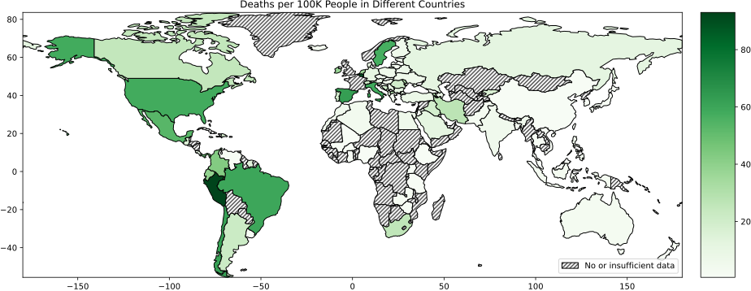

# Self-indulgence and Covid-19 Project

This was a visualization project done using Geopandas for a study conducted by Dr. Cecilia Cheung in the Department of Psychology at the University of California Riverside. The study looked at how the level of self-indulgence (how relaxed people are) is related to the number of Covid-19 positive cases and the number of Covid related deaths (both per 100 K people) in different countries. For details, see this article.

## Indulgence

## Cases per 100K people

## Deaths 100K people

